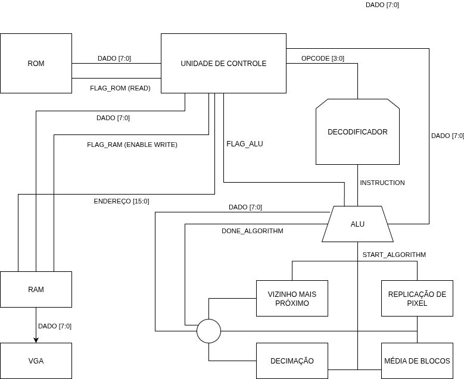
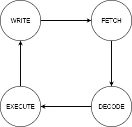
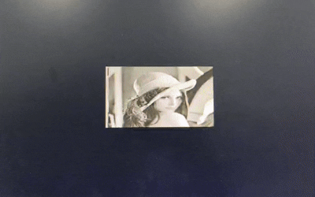
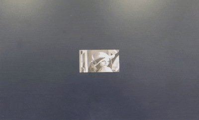
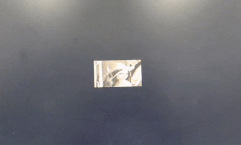

<h1 align="center">Coprocessador gráfico especializado em redimensionamento de imagens</h1>

<h2>Descrição do Projeto</h2>

Para o desenvolvimento do projeto, foi utilizado o kit de desenvolvimento DE1-SoC, equipado com o processador Cyclone V, possibilitando a leitura e escrita de dados diretamente na memória SDRAM do dispositivo. O ambiente de desenvolvimento adotado foi o Intel Quartus Prime Lite 23.1, utilizando a linguagem de descrição de hardware Verilog. O objetivo do projeto é implementar o redimensionamento de imagens por meio de algoritmos de zoom in e zoom out, operações fundamentais em sistemas de processamento digital de imagens por permitirem ajustar a escala de exibição, melhorar a análise visual e atender aplicações como compressão de dados, reconhecimento de padrões, visão computacional embarcada, processamento em tempo real e interfaces gráficas.

     
    <strong>Imagem do Site da Altera</strong>  

O coprocessador é capaz de lidar com os seguintes algoritmos de redimensionamento: 

* Replicação de Pixel (Zoom-in)
* Vizinho mais próximo( Zoom-in)
* Vizinho mais próximo/Decimação (Zoom-out)
* Média de Blocos (Zoom-out)

Sumário
=================
<!--ts-->   
   * [Arquitetura do Projeto](#arquitetura)
   * [Unidade de Controle](#controle)
       * [Decoder](#decoder)
       * [VGA driver](#vga_driver)
       * [Mapping e Offsets](#addr_mapping)
       * [ROM](#rom)
       * [RAM (framebuffer)](#ram)
       * [Mux de Saída](#mux)
       * [Ciclo de Operação](#final)
   * [Memória](#memoria)
   * [Unidade Lógica e Aritmética (ULA)](#ula)
      * [Replicação de Pixel (Zoom_in)](#rep_pixel)
      * [Vizinho mais próximo (Zoom-in)](#nn_zoomin)
      * [Decimação/Vizinho mais próximo (Zoom-out)](#dec)
      * [Média de Blocos(Zoom-out)](#media)
   * [Referências](#referencias)

  <h2 id="arquitetura">Arquitetura do Projeto</h2>
  

  O coprocessador foi desenvolvido utilizando módulos em Verilog que interagem entre si para realizar a leitura da ROM, escrita na RAM e processamento por algoritmos de redimensionamento. A arquitetura é composta pelos módulos principais: <strong>ROM</strong>, <strong>RAM</strong>, <strong>Unidade de Controle</strong> e <strong>Unidade Lógica e Aritmética (ULA)</strong>.

     
    <strong>Imagem da Arquitetura do Projeto</strong>  
  

  <h2 id="controle">Unidade de Controle</h2>
  

    Este módulo implementa a unidade de controle para um sistema de processamento e exibição de imagens em VGA.  
    Ele integra a <b>ROM</b> (imagem original), a <b>RAM</b> (framebuffer ampliado) e o módulo <b>rom_to_ram</b>, 
    responsável por aplicar os algoritmos de redimensionamento.  
    Também gerencia a comunicação com o <b>driver VGA</b>, centralizando a imagem e controlando a saída de cores.
    

     
        <strong>Imagem do ciclo de instrução de UC</strong>  
    

<h3 id="decoder">Decoder</h3>

  Converte os sinais de entrada em um <b>opcode</b>, 
  definindo qual operação de redimensionamento deve ser executada.  
  Além disso, gera o sinal decoding, que habilita o uso da RAM como framebuffer.

 <table border="1" align="center">
    <tr>
      <th>Opcode</th>
      <th>Operação</th>
    </tr>
    <tr>
      <td><code>001</code></td>
      <td>Zoom-in por replicação de pixels</td>
    </tr>
    <tr>
      <td><code>011</code></td>
      <td>Zoom-in por vizinho mais próximo</td>
    </tr>
    <tr>
      <td><code>010</code></td>
      <td>Zoom-out por decimação</td>
    </tr>
    <tr>
      <td><code>100</code></td>
      <td>Zoom-out por média de blocos</td>
    </tr>
  </table>

  <h3 id="vga_driver">VGA Driver</h3>
  

    Gera os sinais de sincronismo e controla a varredura da tela VGA.  
    Informa as próximas coordenadas de pixel a serem exibidas e recebe os valores de cor correspondentes da ROM ou RAM.
  

  <h3 id="addr_mapping">Mapping e Offsets</h3>
  

    Calcula os parâmetros da imagem de acordo com o fator de redimensionamento e centraliza na tela VGA 
    (640×480) através dos offsets.  
    Também mapeia as coordenadas da tela para endereços de memória da ROM e da RAM.
  

  <h3 id="rom">ROM (Imagem Original)</h3>
  

    Armazena a imagem original em baixa resolução 160×120.  
    Quando não há redimensionamento ativo, o sistema lê diretamente os pixels da ROM para exibição na tela.
  

  <h3 id="ram">RAM (Framebuffer)</h3>
  

    Recebe a imagem processada pelo copier.  
    Quando o redimensionamento está habilitado entra em estado de decoding e a saída exibida vem da RAM, 
    garantindo que a imagem ampliada ou reduzida seja renderizada corretamente.
  

  <h3 id="mux">MUX de Saída</h3>
  

    Seleciona entre os dados da ROM ou da RAM, dependendo do modo de operação.  
    O valor escolhido é então enviado ao driver VGA para exibição do pixel.
  

  <h3 id="final">Ciclo de Operação</h3>
  

    1. O usuário define o modo no seletor. 
    2. O <b>decoder</b> gera o opcode e habilita/desabilita a RAM. 
    3. O módulo <b>ALU</b> processa a imagem (se necessário). 
    4. O <b>multiplexador</b> escolhe a fonte de dados (ROM ou RAM). 
    5. O <b>driver VGA</b> exibe a imagem centralizada na tela. 
  

  <h2 id="memoria">Memória</h2>
  

    O sistema utiliza dois tipos principais de memória: <b>ROM</b>, que armazena a imagem original em baixa resolução,
    e <b>RAM</b>, utilizada como framebuffer para armazenar as imagens processadas.  
    A interação entre essas memórias garante flexibilidade no redimensionamento, permitindo alternar entre a exibição da imagem
    original e a exibição da versão ampliada ou reduzida.
  

  <h3>ROM (Read-Only Memory)</h3>
  

    A <b>ROM</b> armazena a imagem base com resolução <code>160×120</code>.  
    Ela é de acesso somente leitura, garantindo que os dados originais permaneçam inalterados.  
    Quando o sistema não executa nenhuma operação de redimensionamento, os pixels são lidos diretamente da ROM para a saída VGA.
  

  <h3>RAM (Random Access Memory)</h3>
  

    A <b>RAM</b> funciona como <i>framebuffer</i>, recebendo as imagens já processadas pelos algoritmos da ULA.  
    Nessas situações, a saída da tela VGA é alimentada pela RAM, que armazena a versão ampliada ou reduzida da imagem.  
    Esse mecanismo permite processar os dados em tempo real e exibir o resultado com eficiência.
  

  <h3>Integração ROM ↔ RAM</h3>
  

    A comunicação entre ROM e RAM ocorre por meio da <b>unidade de controle</b> e dos módulos de processamento.  
    - A ROM fornece os pixels originais para a ULA. 
    - A ULA aplica o algoritmo de redimensionamento selecionado. 
    - O resultado é escrito na RAM, que serve de fonte para o <b>driver VGA</b>.  
    Essa integração garante que o sistema possa alternar de forma dinâmica entre a exibição direta da imagem original
    ou da versão redimensionada.
  

  <h2 id="ula">Unidade Lógica e Aritmética (ULA)</h2>
  

  A ULA do coprocessador é responsável por aplicar os algoritmos de redimensionamento sobre a imagem.
  Abaixo estão descritas as técnicas utilizadas:
  

<h3 id="rep_pixel">Replicação de Pixel (Zoom-in)</h3>

O módulo implementa o algoritmo de <b>Zoom-in por replicação de pixels</b>, uma técnica de redimensionamento de imagens.  

     
    <strong>Simulação do algoritmo <code>160 × 120</code> para <code>320 × 240</code> </strong>  

#### &#8594; Funcionamento
- A imagem original é armazenada na **ROM** com dimensões <code>LARGURA × ALTURA</code>.  
- Cada pixel é copiado várias vezes em sequência, formando um bloco de tamanho <code>FATOR × FATOR</code> na imagem de saída.  
- Assim, a resolução final é multiplicada pelo fator escolhido. Exemplo: com <code>FATOR = 2</code>, uma imagem de <code>160 × 120</code> se torna <code>320 × 240</code>.  

#### &#8594; Lógica do processo
1. A imagem é percorrida pixel a pixel na ordem de linhas e colunas.  
2. Cada pixel é replicado para gerar um bloco ampliado na saída.  
3. Quando todos os pixels são processados, o módulo sinaliza a conclusão através de <code>done</code>.  

#### &#8594; Vantagens
- Implementação **baixa complexidade** e rápida em hardware.  
- Preserva as cores e a estrutura da imagem original.  

#### &#8594; Limitação
- A ampliação pode gerar uma aparência **mais quadrada ou pixelada**, principalmente em fatores maiores. 

<h3 id="nn_zoomin">Vizinho mais próximo (Zoom-in)</h3>

O módulo implementa o algoritmo de <b>Zoom-in por vizinho mais próximo</b>, uma técnica de redimensionamento em que cada novo pixel da imagem ampliada assume o valor do pixel original mais próximo.  

     
    <strong>Simulação do algoritmo <code>160 × 120</code> para <code>320 × 240</code> </strong>  

#### &#8594; Funcionamento
- A imagem original está armazenada na **ROM** com dimensões <code>LARGURA × ALTURA</code>.  
- A saída é uma nova versão ampliada, armazenada na **RAM VGA**, com dimensões <code>NEW_LARG × NEW_ALTURA</code>.  
- Cada posição da imagem ampliada é associada ao pixel mais próximo da imagem original.  

#### &#8594; Lógica do processo
1. A imagem ampliada é percorrida em todas as posições de saída.  
2. Para cada coordenada, identifica-se o pixel correspondente da imagem original mais próximo.  
3. Esse pixel é então copiado para a nova posição da saída.  
4. Ao final do processamento, o módulo indica que a ampliação está completa.  

#### &#8594; Vantagens
- Mantém a **nitidez relativa** da imagem original.  
- Adequado para uso em hardware por não exigir cálculos complexos.  

#### &#8594; Limitação
- Pode deixar a imagem com uma aparência **mais quadrada ou pixelada**, já que não aplica técnicas de suavização ou interpolação. 

<h3 id="dec">Decimação / Vizinho mais próximo (Zoom-out)</h3>

O módulo implementa o algoritmo de <b>Zoom-out por decimação de pixels</b>, uma técnica de redimensionamento de imagens digitais descartando parte dos pixels da imagem original.  

     
    <strong>Simulação do algoritmo <code>160 × 120</code> para <code>80 × 60</code> </strong>  

#### &#8594; Funcionamento
- A imagem original está armazenada na **ROM** com dimensões <code>LARGURA × ALTURA</code>.  
- A nova imagem reduzida é escrita na **RAM VGA** com dimensões <code>NEW_LARG × NEW_ALTURA</code>.  
- O módulo seleciona apenas alguns pixels da entrada, pulando outros de acordo com o fator de redução definido (<code>FATOR</code>).  

#### &#8594; Lógica do processo
1. A imagem original é percorrida em passos de <code>FATOR</code> em ambas as direções (horizontal e vertical).  
2. Apenas os pixels nas posições múltiplas de <code>FATOR</code> são copiados para a saída.  
3. Assim, uma imagem de <code>160 × 120</code> com <code>FATOR = 2</code> é reduzida para <code>80 × 60</code>.  
4. Ao final, o módulo aciona o sinal <code>done</code>, indicando que a redução está concluída.  

#### &#8594; Vantagens
- Reduz significativamente a quantidade de dados a serem processados ou armazenados.  
- Útil em aplicações de **pré-processamento** e **compressão de imagens**.  

#### &#8594; Limitação
- Pode haver **perda de detalhes** visuais.  
- Linhas e bordas finas da imagem original podem desaparecer após a redução. 

<h3 id="media">Média de Blocos (Zoom-out)</h3>

O módulo implementa o algoritmo de <b>Zoom-out por média de blocos</b>, uma técnica que reduz a resolução da imagem calculando a média dos pixels em cada região.  

     
    <strong>Simulação do algoritmo <code>160 × 120</code> para <code>80 × 60</code> </strong>  

#### &#8594; Funcionamento
- A imagem original é armazenada na **ROM** com dimensões <code>LARGURA × ALTURA</code>.  
- A imagem reduzida é gerada na **RAM VGA** com dimensões <code>NEW_LARG × NEW_ALTURA</code>.  
- Para cada bloco de tamanho <code>FATOR × FATOR</code> da imagem original, o módulo calcula a **média dos valores de intensidade** e escreve um único pixel na saída.  

#### &#8594; Lógica do processo
1. A imagem é dividida em blocos de <code>FATOR × FATOR</code>.  
2. Os pixels de cada bloco são lidos e somados em um acumulador.  
3. Ao final da leitura de todos os pixels do bloco, o valor médio é calculado.  
4. Esse valor médio é armazenado na posição correspondente da imagem de saída.  
5. O processo se repete para todos os blocos até completar a imagem.  

#### &#8594; Vantagens
- Reduz a imagem de forma mais **suave** que a decimação simples.  
- Mantém mais informações globais da imagem, evitando perda brusca de detalhes.  
- Adequado para aplicações de **compressão**, **pré-processamento** e **redução de ruído**.  

#### &#8594; Limitação
- Pode causar **perda de nitidez** em áreas com muitos detalhes.  
- Linhas ou padrões muito finos podem ficar menos visíveis após a redução. 

  <h2 id="referencias">Referências</h2>
    
  * PATTERSON, D. A.; HENNESSY, J. L. Computer organization and design : the hardware/software interface, ARM edition / Computer organization and design : the hardware/software interface, ARM edition. 
  * Cyclone V Device Overview. Disponível em: <https://www.intel.com/content/www/us/en/docs/programmable/683694/current/cyclone-v-device-overview.html>. 
  * TECHNOLOGIES, T. Terasic - SoC Platform - Cyclone - DE1-SoC Board. Disponível em: <https://www.terasic.com.tw/cgi-bin/page/archive.pl?Language=English&No=836>. 
  * DUNNE, Robert. Computer Architecture Tutorial Using an FPGA: ARM & Verilog Introductions. Downers Grove, Illinois: Gaul Communications, 2020. ISBN 978--970112491. 
  * GONZALEZ, Rafael C.; WOODS, Richard E. Processamento Digital de Imagens. 3. ed. São Paulo: Pearson Prentice Hall, 2010.
  * FPGAcademy. Disponível em: <https://fpgacademy.org>. 

